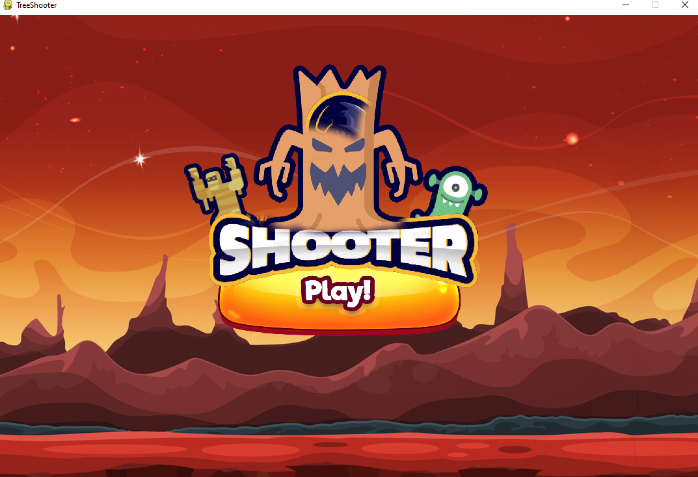
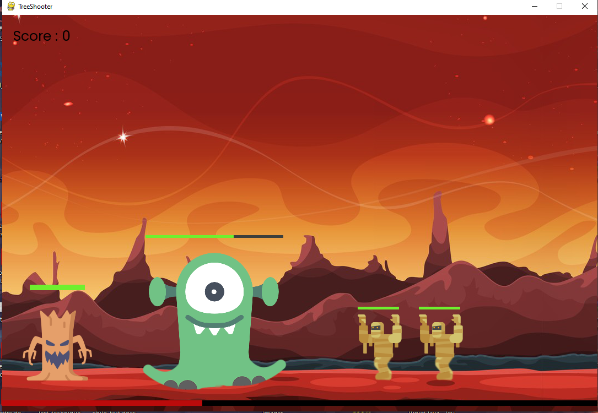
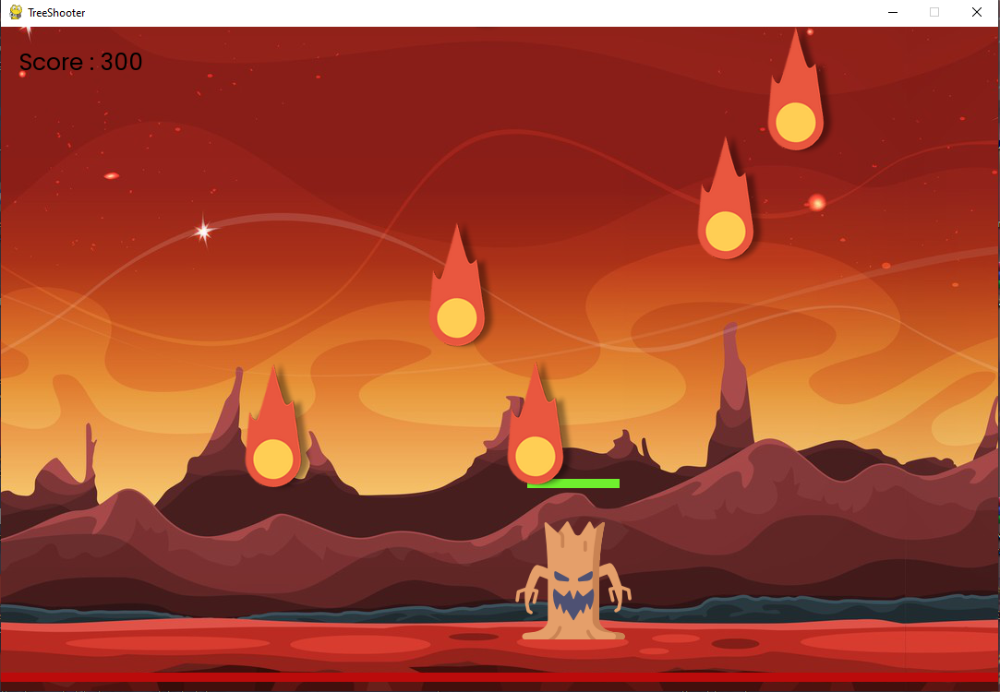

# 🌳👽🌠 TreeShooter

# Jeu 2D

Ceci est un projet de jeu 2D développé avec Python et la bibliothèque Pygame.

### Voici à quoi ressemble le jeu : 

<p align="center"></p>
<p align="center"></p>
<p align="center"></p>

## Description

Le jeu est un jeu 2D dans lequel le joueur contrôle un personnage et doit affronter des monstres tout en évitant les météores qui tombent du ciel. Le joueur peut attaquer les monstres en lançant des projectiles. Le but du jeu est de survivre le plus longtemps possible tout en marquant des points en éliminant les monstres.

## Fonctionnalités

- Contrôles du joueur : déplacement à gauche et à droite.
- Génération aléatoire de monstres avec différentes caractéristiques.
- Mécanique de tir de projectiles pour attaquer les monstres.
- Gestion des collisions entre les projectiles, le joueur, les monstres et les météores.
- Barre de santé pour le joueur et les monstres.
- Système de score pour suivre les performances du joueur.
- Événement de chute de météores qui augmente en intensité avec le temps.
- Sons pour les actions du joueur et les événements du jeu.
- Graphismes 2D avec des sprites animés.

## Installation

1. Assurez-vous d'avoir Python 3.x installé sur votre système .
2. Installez la bibliothèque Pygame en exécutant la commande suivante :

```
shell
pip install pygame
```
Clonez ce dépôt de code sur votre machine.
Accédez au répertoire du projet et exécutez le fichier principal `main.py` pour lancer le jeu.

`python main.py`

## Contrôles du jeu

- Déplacement du joueur : Utilisez les touches fléchées gauche et droite pour vous déplacer.
- Tir de projectiles : Appuyez sur la barre d'espace pour lancer des projectiles.

## Contribuer

Les contributions sont les bienvenues ! Si vous souhaitez apporter des améliorations ou résoudre des problèmes, veuillez créer une pull request.

## Remerciements

Ce jeu a été développé en utilisant la bibliothèque Pygame et s'inspire de différents tutoriels et ressources en ligne.

#### by @ranki


